# Arduboat Tutorial

- Justin and Buddies

After two weeks and four days of solders, shorts, and software struggles, we were given a different flight controller for our boat. This is a compilation of a single day of work the day before the final field test. Luckily the boat worked well until we tried to tow a buoy behind it. Below is a step-by-step guide to building your own autonomous boat. Hope this helps!

1. **RC Boat**

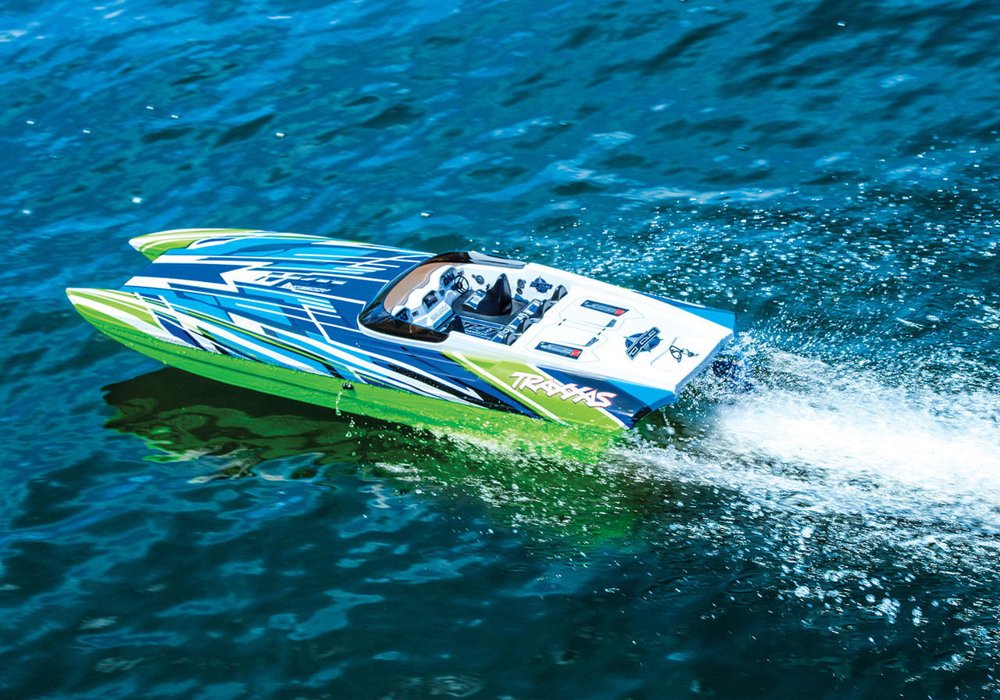

Our group used the [Traxxas m41 widebody](https://traxxas.com/products/models/marine/DCBM41) as the main body of the boat. This is a replica of a racing boat and is capable of speeds over 50 mph. But our boat will be moving at much slower speeds to collect oceanographic data.

2. **Flight controller**

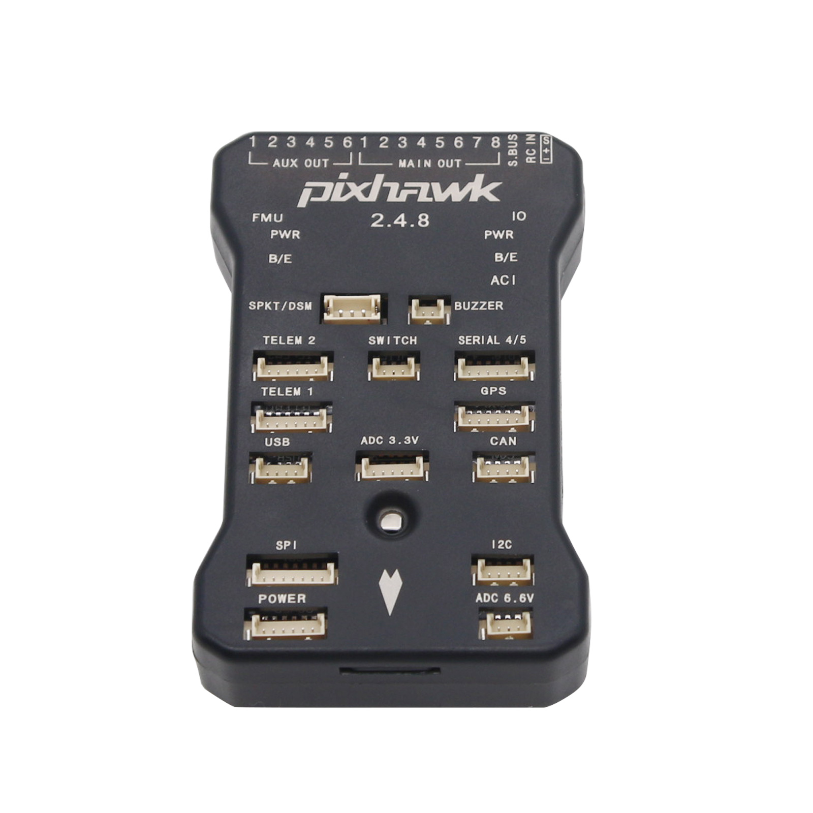

The flight controller we used on the final boat was a pixhawk 2.4.8. Since the firmware on this device is a bit older, we must update the firmware with QGroundControl.

QGroundControl: [https://docs.qgroundcontrol.com/master/en/getting_started/download_and_install.html](https://docs.qgroundcontrol.com/master/en/getting_started/download_and_install.html)

This will allow us to easily update the firmware on the Pixhawk and other hardware that we will be using later.

Open QGroundControl -> Select Tool -> Vehicle Setup -> Summary -> Firmware (Unplug then plug in pixhawk) -> Settings

3. **Software**

Our flight controller will be running on Ardupilot, which is an open source firmware for drones. Mission Planner is the ground control system for Ardupilot where we will be communicating with the flight controller.

Mission Planner: 

[https://ardupilot.org/planner/docs/mission-planner-installation.html#](https://ardupilot.org/planner/docs/mission-planner-installation.html#)

To connect the flight controller to Mission Planner, make sure to use a data usb cable, not a power only cable. Power only cables will not allow the controller to connect.

To connect, first check all the available ports in the dropdown menu, then plug in the controller and select the new option that pops up. Set the baud rate in the next dropdown as 9600 since we are on a serial connection currently. Click connect and wait for the flight controller to make a connection.

If you have COM port issues, download these virtual COM Port drivers for your computer.

[https://ftdichip.com/drivers/vcp-drivers/](https://ftdichip.com/drivers/vcp-drivers/)

Now you should be able to see the movement of the flight controller in the left hand panel.

To set the flight controller as a boat, go to 

_Setup -> Full Parameter List -> Search FRAME_CLASS -> Set as 2_

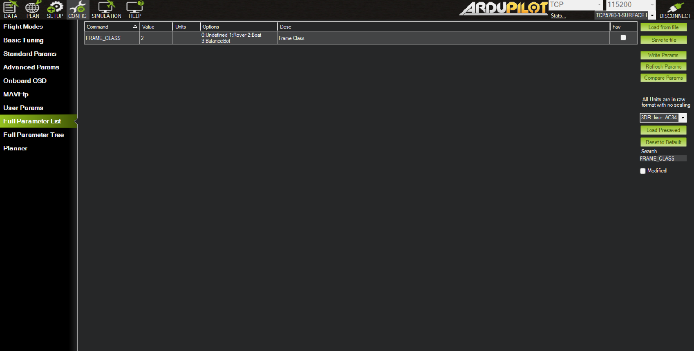

4. **Radios**

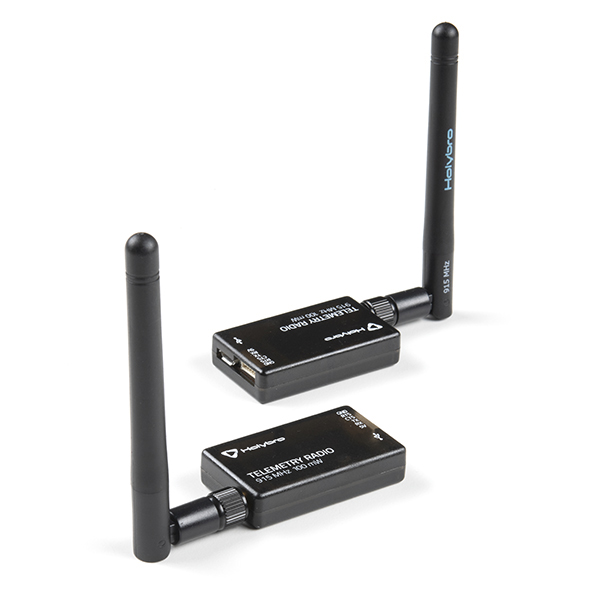

The radios we used were SiK 915 MHz, which has a baud rate of 57600. To connect these to the flight controller, plug one radio into TELEM1 on the pixhawk and one into the computer through USB.

Now to connect the radios, click 

_Setup -> Optional Hardware -> SiK Radio_

Now click load settings and the settings should appear in Mission Planner.

If the settings are not loading, connect the radios by USB to QGroundControl and update the firmware.

_Select Tool -> Vehicle Setup -> Summary -> Firmware (Unplug then plug in Pixhawk) -> Settings_

5. **GPS/Compass**

We used the _GPS Module GPS NEO-M8N BDS Compass Module_ as our gps and compass. Plug in the larger adapter into the GPS slot and the smaller in the I2C on the Pixhawk.

Open Mission Planner and connect the Pixhawk.

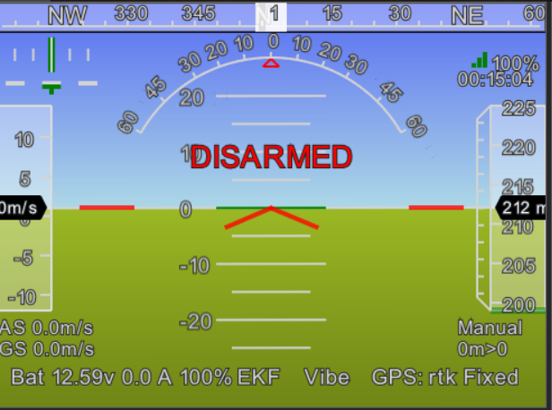

Indoors, the GPS will not fix on the satellite, so you must go outdoors in at least a semi-open space for a fix. Now, the GPS should be functioning.

To calibrate the compass, open Mission Planner and connect the Pixhawk, and go to

_Data -> Setup -> Mandatory Hardware -> Compass -> Follow the steps for calibration_

It will ask you to move the compass in multiple directions for a bit.

Now the compass and GPS should work in ideal conditions.

We printed a GPS stand to attach it to the outside of the boat: [https://drive.google.com/file/d/1A_vzA1YP445HYMUqo_vrnWkr_7P-FACy/view](https://drive.google.com/file/d/1A_vzA1YP445HYMUqo_vrnWkr_7P-FACy/view)

6. Batteries

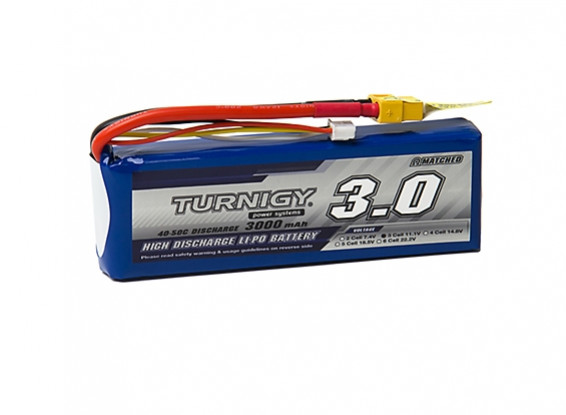

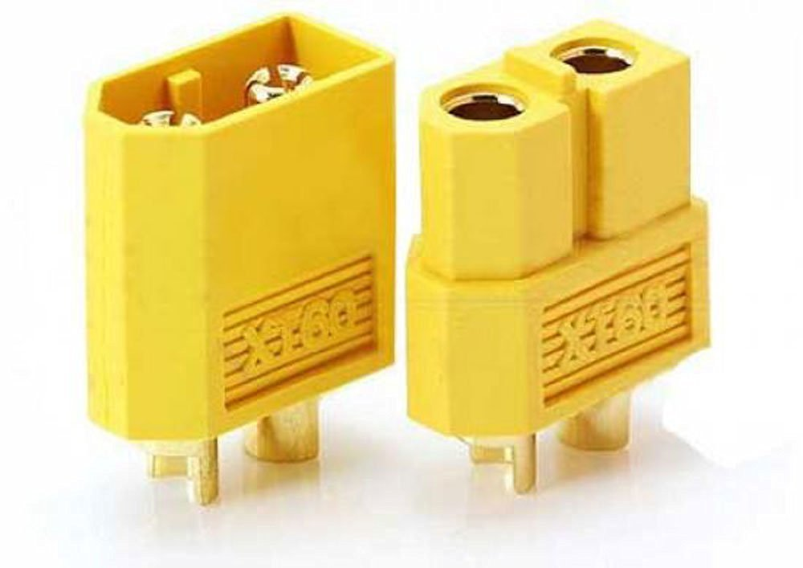

Traxxas has their own proprietary connectors, so we need to solder on new adapters (XT60) to fit the lipo batteries that we are using. In addition, we added battery alarms to each battery.

7. Motors + Servos

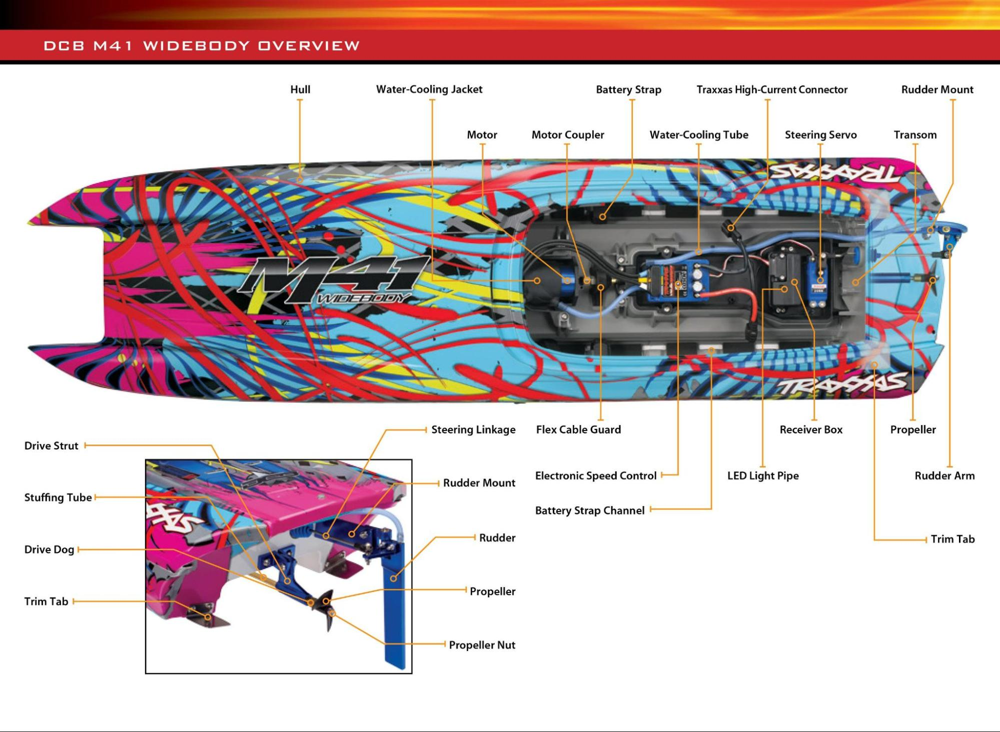

In order to make the boat autonomous, we must connect the Pixhawk to the ESC (connects to motor) and servo (rudder). This will allow us to control the throttle and steering through Mission Planner. 

First we need to remove the receiver box in the boat so we can override their messages.

Remove the entire box with the receiver inside of it.

After that you should have two 3 pin wires: one from the ESC and one from the servo.

8. RC controller + receiver

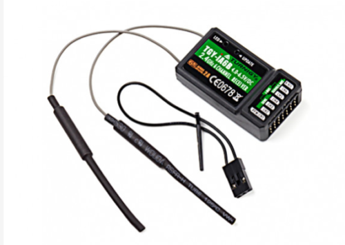

For any autonomous boat, we need a safety switch to change to manual control in case of any problems. To do this, we can attach a 3+ channel RC receiver to the pixhawk: one channel for throttle, another for steering, and another for changing between autonomous and manual mode. We used a TGY i65 controller with its receiver.

First we want to test just the RC receiver and the boat itself, so let's take the ESC pin and plug it into the first channel and the servo into the third. 

On the controller itself, make sure the channels of the two joysticks are set to the first and third so the boat will respond to the commands.

With the batteries plugged in, the ESC should go through a mario-kart-esque beeping sequence and stop. In case it doesn't, try binding the receiver with the controller: 

On the controller, go to Endpoints and set the both endpoints of the throttle to 50%. This will prevent the boat from driving at extreme speeds in a tightly confined pool, hopping over lanes and breaking propellers. 

This should not be a problem in open waters.

With the boat on a stand or with the rudder and prop hanging off the edge of a table, you can try the controls. It should be able to spin forward and backwards, as well as turn the rudder side to side. 

9. Rudders + Propellers

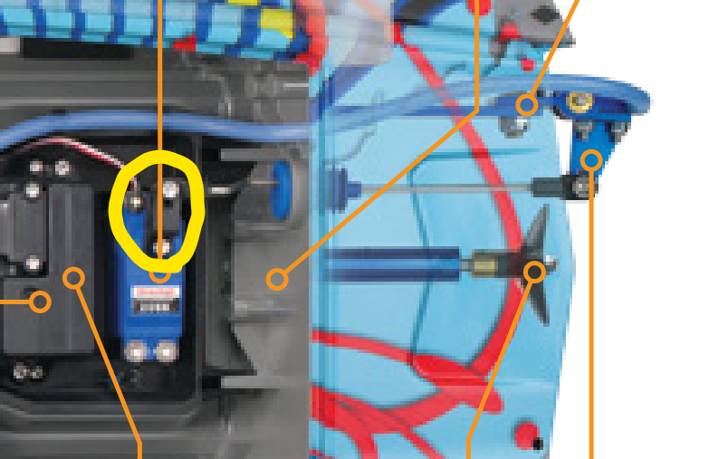

The rudder on the boat is meant for a fast moving craft, so for a slow moving craft, we must create a larger rudder for the same turning effectiveness.

The design of the boat causes the esc and motor to be water cooled by water pulled in from the rudder, so we must 3d print a new rudder that has the same holes. In addition, the current servo arm has a limited range, so we need to print a longer one for more range in the rudder.

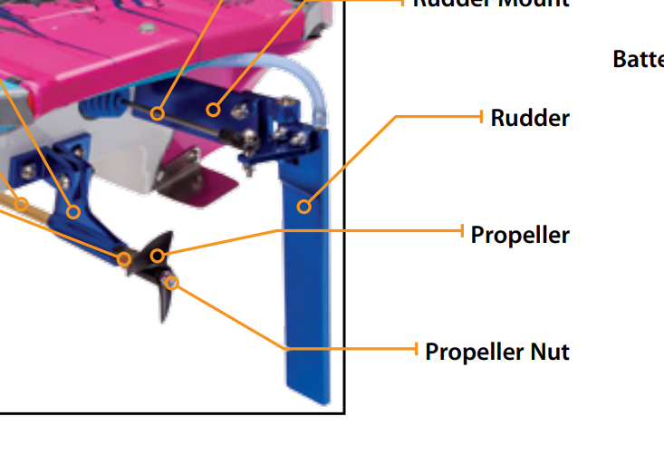

Here is the progression of designs for the rudder:

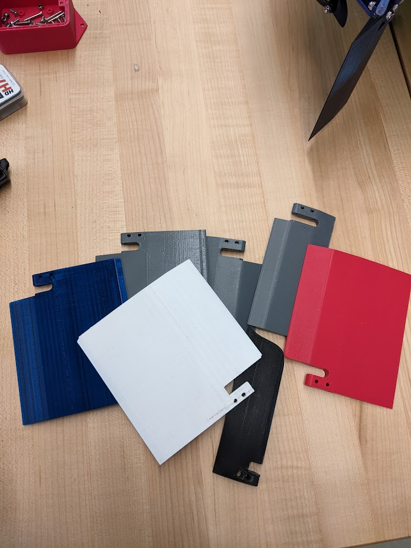

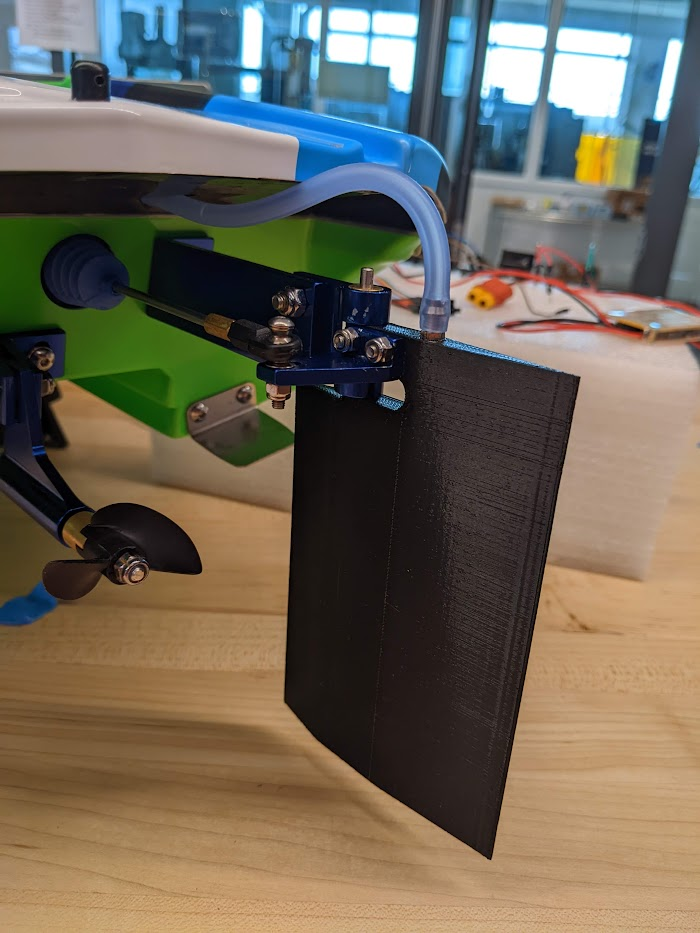

We eventually settled on the larger rudder with a few small design changes along the way. Here is the final design we used:

[https://cad.onshape.com/documents/341f0bfbb7fd9b8641d10de2/w/ccba5a872075a3eeead7d582/e/0432abc8975b2662196b00e9](https://cad.onshape.com/documents/341f0bfbb7fd9b8641d10de2/w/ccba5a872075a3eeead7d582/e/0432abc8975b2662196b00e9)

For the servo arm, we used a similar design to the original and increased the length incrementally until we reached the final design.

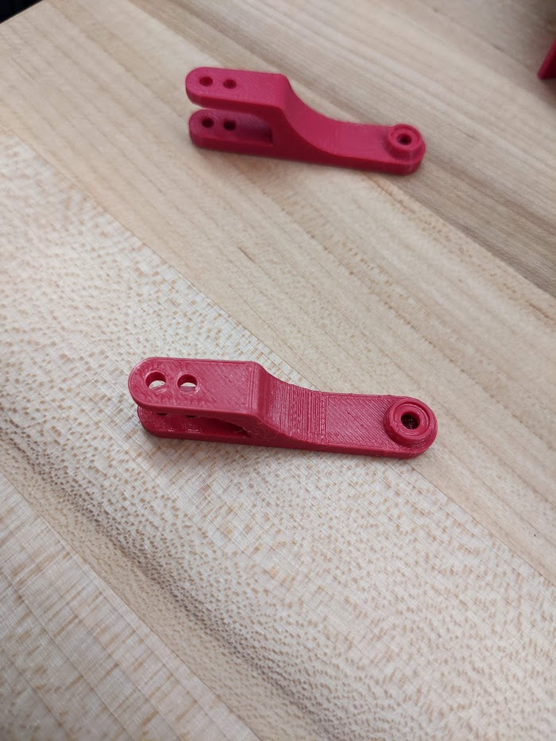

Here is the link to the final servo arm design: [https://cad.onshape.com/documents/2f5a1ff8fc77d09ff0f33b28/w/96a95d3afae6904bacc3db46/e/c4438d96de7ada338bfaa74e](https://cad.onshape.com/documents/2f5a1ff8fc77d09ff0f33b28/w/96a95d3afae6904bacc3db46/e/c4438d96de7ada338bfaa74e)

10. 3D printed boxes

Most of the electronics are not waterproof or water resistant, so we must put them in boxes or add a water resistant coating to them. For the radios, pixhawk, and rc receiver, we printed boxes for them. 

Pixhawk Container: [https://cad.onshape.com/documents/f0dcd2dc360e6153a8aceb5b/w/83c42524679d51935942d68b/e/775b05789a6a2d5d23418cd0](https://cad.onshape.com/documents/f0dcd2dc360e6153a8aceb5b/w/83c42524679d51935942d68b/e/775b05789a6a2d5d23418cd0)

Radio Container: [https://cad.onshape.com/documents/cbe6cff6ed3df61fe2a0e150/w/ee1321990144475658df51f7/e/609a2fe643e35127236df8c1?renderMode=0&uiState=62e99a79c21ec068bef4b431](https://cad.onshape.com/documents/cbe6cff6ed3df61fe2a0e150/w/ee1321990144475658df51f7/e/609a2fe643e35127236df8c1?renderMode=0&uiState=62e99a79c21ec068bef4b431)

RC receiver container:

[https://cad.onshape.com/documents/975f2f7a7f84f6e907830d6b/w/4012b4122810d31c85e447a8/e/c716113e8b8c94d3e3576a56](https://cad.onshape.com/documents/975f2f7a7f84f6e907830d6b/w/4012b4122810d31c85e447a8/e/c716113e8b8c94d3e3576a56)

On the other hand, the GPS was on the outside of the boat, so we gave it multiple coats in a silicon coating to make it water resistant.

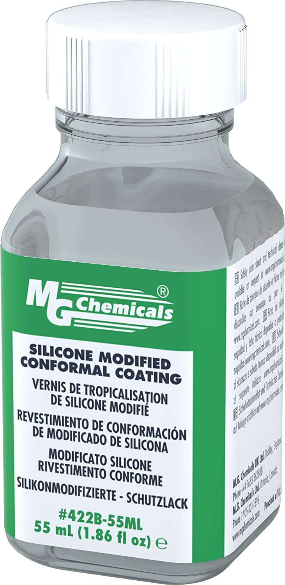

With these boxes and sealant, we should be safe when any water splashes into the boat.

11. **Putting it together**

Now that we have all the components of the boat working, we can link it all together. 

Power on the boat, and then plug the ESC pin into Main3 and the servo pin into Main2 on the Pixhawk. Now connect one radio into the pixhawk and one in the computer. Hopefully, the radios both have solid green lights, which means that they are connected. If not, that is ok and we can fix it later.

Now open Mission Planner and select the COM port and set the baud rate to 57600, which is what our radios use. Now click connect. If it connects, it will take a few seconds for the radios to completely link together. 

If not, click cancel and try again or change the COM port to auto. If it still persists after several attempts, try a different USB port on the computer.

Now to setup the motor and servo go to 

_Setup -> Mandatory Hardware -> Servo Output_

Set 2 to Ground Steering and 3 to throttle

You can change the turn radius and motor speed with the min, max, and trim values on the side.

Now go back to Data and click the actions tab in the bottom left panel

From here click Arm to arm the boat

Now to test, go to 

_Setup -> Optional Hardware -> Motor Test_

Make sure to set the value of the throttle to at least 15% from the default 5%. Motor A should be the throttle and motor B should be the rudder. To test the rudder, set the throttle to 100% and -100% to test the full range of the rudder.

Now we will test the radio control.

Plug a 3 pin connector from RC IN on the rc receiver to S-BUS slot in the top right

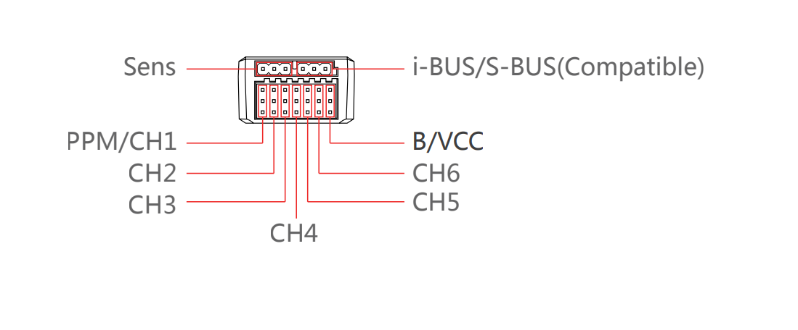

Next, 

_Setup -> Mandatory Hardware -> Radio Calibration _

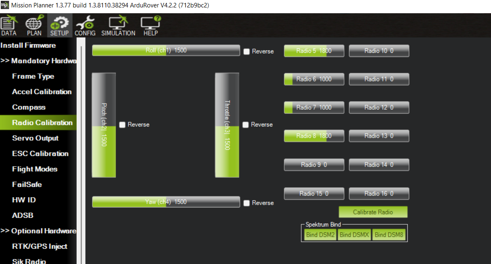

Make sure the channels are correct. Now, to switch to manual mode, use the switch in the top left(radio 6). It has two modes: the flipped down mode should be manual control and the upwards one should be auto.

Now go to the main page again and arm the boat, then flip the switch to manual.

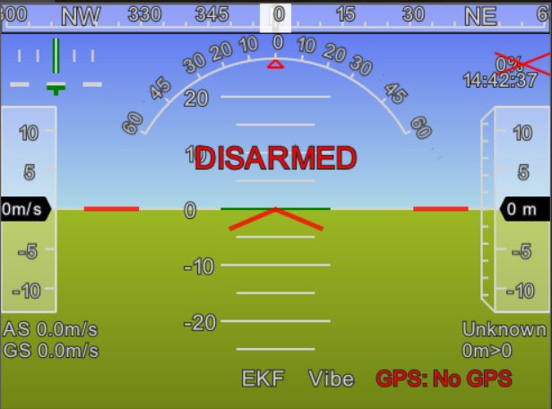

Now test the boat and the RC should be functioning.

12. Path planning + automation

To create a path, go to the Plan Tab, and if the GPS is connected, you should see a boat at your current location.

Now you can click on points for the boat to follow. For our boat, we want it to stop at certain locations for a set amount of time, and we can do that with the LOITER_TIME function. This tells the boat to hover in a certain place for a set time.

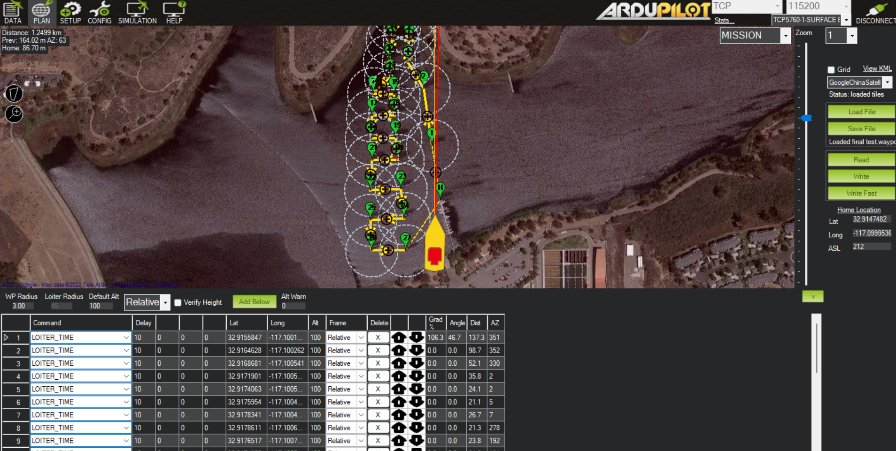

To save the file, press save file on the right, and you can load in the file anytime you want.

Now to test the automation, create a short path from your location, and click the write button. This will write the waypoints into the flight controller so it knows where to go. 

Now go back to the Data page and select the actions tab. Now change the first default dropdown to MISSION_START

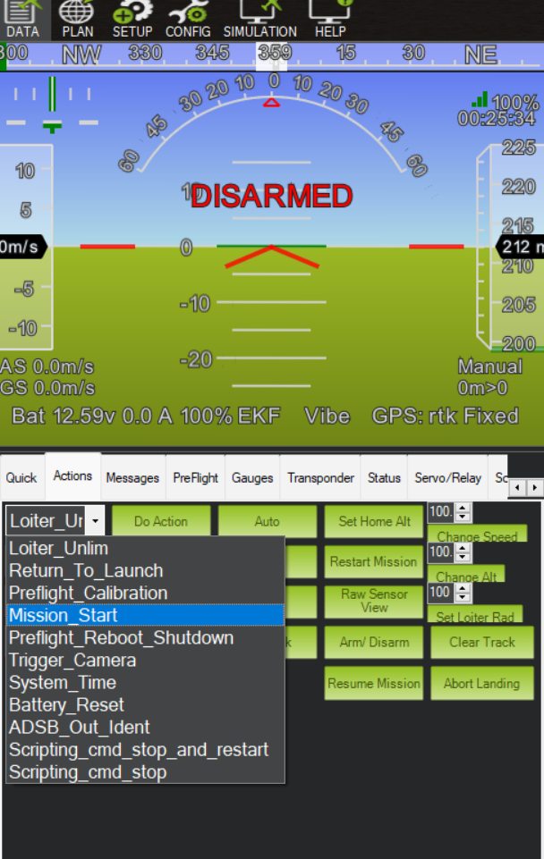

Now arm the boat, and then click the **Do Action** Button.

If the rudder is inverted go to the servo output page and click reverse. Make sure to test the min, max, and trim of the throttle for a good speed.

13. Done!

Thanks for reading through! Hope this helps you on your journey of making an autonomous boat.

* Justin and Buddies
14. Pictures!

Team members!

Justin Leong

Josh Tian

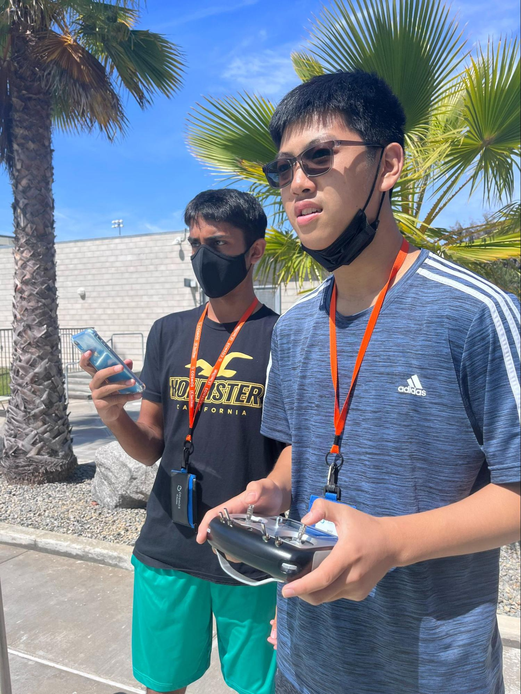

Saarth Gaonkar

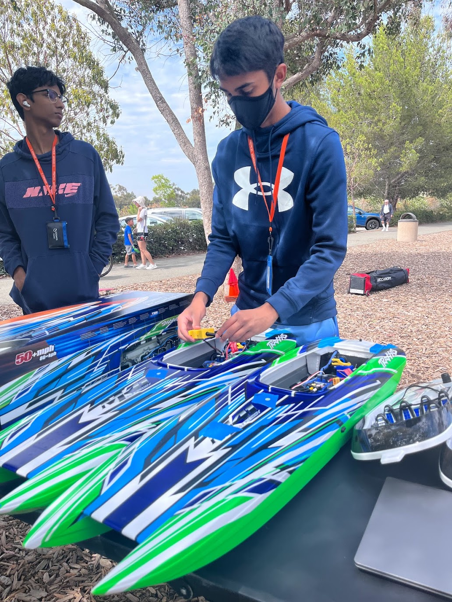

Daisy Zheng

Deon Petrizzo

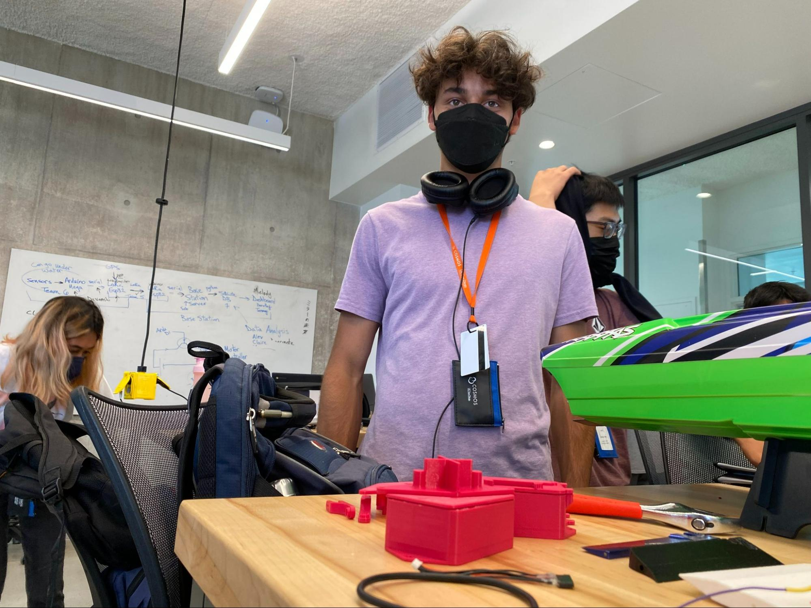

Tyler Synder

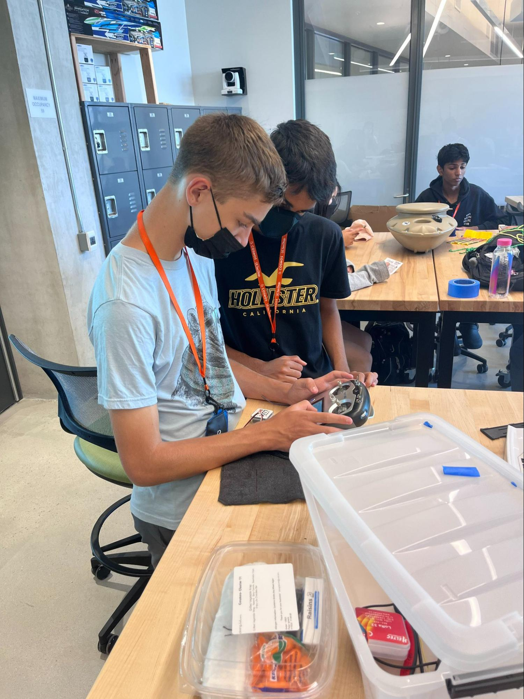

