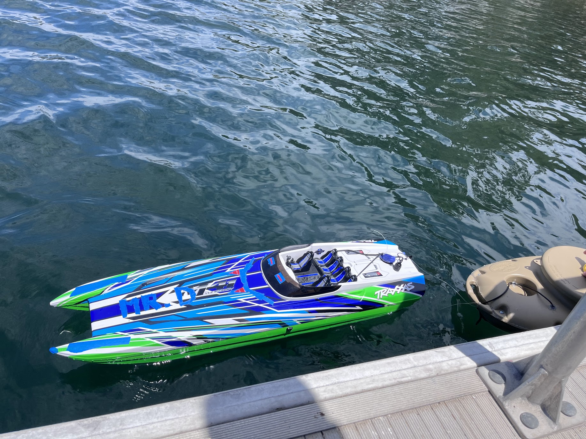
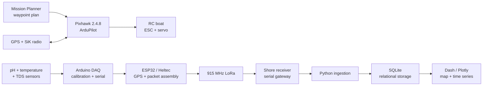
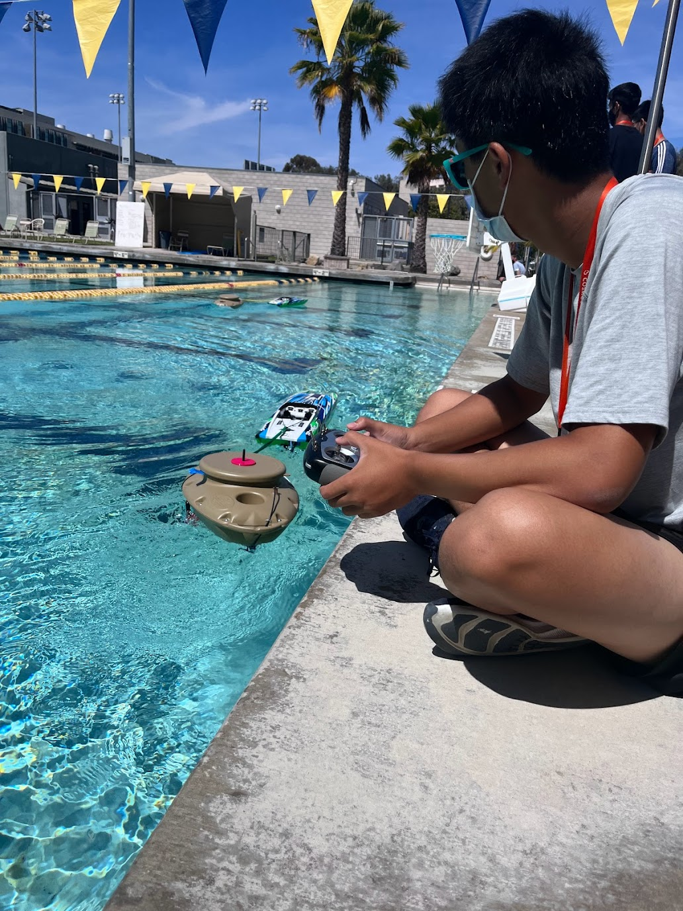
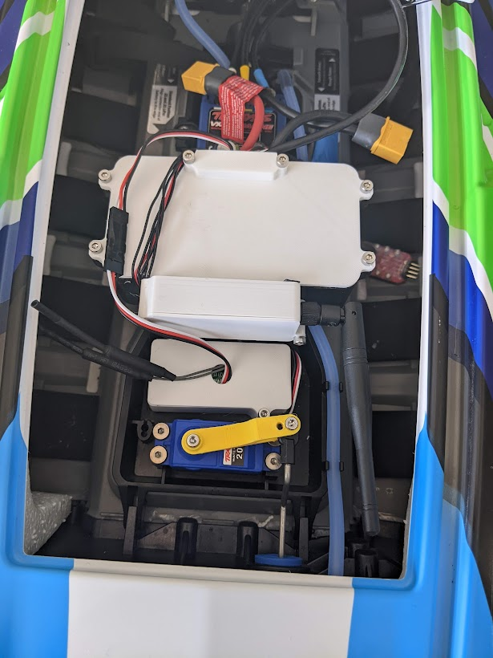

# Autonomous Boat & Water-Quality Telemetry System

An autonomous surface vehicle and instrumented buoy built to collect geotagged water-quality measurements across a lake, transmit them over LoRa, and store and visualize the resulting data on shore.

The project combined autonomous navigation, mechanical design, embedded sensing, long-range radio, serial data acquisition, relational storage, and field analysis in one physical system.

<p align="center">
  
</p>

## Demonstrated results

- Executed an autonomous **27-waypoint grid** during testing at Lake Miramar.
- Transmitted **pH, temperature, and total dissolved solids (TDS)** readings with GPS coordinates and timestamps over **915 MHz LoRa**.
- Collected **2,146 synchronized field records** in the final SQLite dataset, with one pH, temperature, and TDS measurement associated with each location-time record.
- Validated LoRa communication over **several hundred meters** in field testing.
- Designed and iterated water-resistant electronics enclosures, rudders, servo linkages, propellers, sensor mounts, and a motorized depth-deployment mechanism.

## System architecture


```mermaid
flowchart LR
    MP["Mission Planner<br/>waypoint plan"] --> PX["Pixhawk 2.4.8<br/>ArduPilot"]
    GPS["GPS + SiK radio"] <--> PX
    PX --> BOAT["RC boat<br/>ESC + servo"]

    SENS["pH + temperature<br/>+ TDS sensors"] --> DAQ["Arduino DAQ<br/>calibration + serial"]
    DAQ --> ESP["ESP32 / Heltec<br/>GPS + packet assembly"]
    ESP --> LORA["915 MHz LoRa"]
    LORA --> BASE["Shore receiver<br/>serial gateway"]
    BASE --> PY["Python ingestion"]
    PY --> DB["SQLite<br/>relational storage"]
    DB --> DASH["Dash / Plotly<br/>map + time series"]
```

## Engineering breakdown

| Subsystem | Implementation | Evidence |
| --- | --- | --- |
| Autonomous boat | Converted a Traxxas RC boat to ArduPilot control using a Pixhawk 2.4.8, GPS, SiK telemetry radio, ESC, steering servo, and manual RC override. | [Boat overview](1-boat/README.md) · [development log](1-boat/Boat_Development.md) · [field photos](1-boat/boat-team-images) |
| Mechanical integration | Iterated 3D-printed electronics enclosures, propellers, rudders, servo linkages, sensor mounts, spool components, and a motor casing adapter. | [CAD and printable parts](2-buoy-telemetry/Files) |
| Buoy and embedded telemetry | Integrated pH, temperature, TDS, and GPS data; assembled timestamped packets; transmitted them through Heltec ESP32 LoRa radios; and displayed received packets and RSSI on the shore unit. | [Telemetry firmware](2-buoy-telemetry/Files/buoy1-LoRa-GPS.ino) · [receiver firmware](2-buoy-telemetry/receiver.ino) |
| Depth deployment | Controlled a motorized instrument spool with encoder feedback, a magnetic home/stop sensor, input filtering, and a deploy/retract state machine. | [Deployment firmware](2-buoy-telemetry/Files/buoy-with-motor.ino) · [mechanical timeline](2-buoy-telemetry/Buoy-Timeline.pdf) |
| Data acquisition | Calibrated and oversampled the three water-quality sensors, then relayed measurements between Arduino and ESP32 microcontrollers over serial. | [DAQ overview](3-data_acquisition/README.md) · [technical notes](3-data_acquisition/details.md) |
| Storage and analysis | Parsed shore-station serial packets in Python, stored related measurements in SQLite, and rendered location-aware maps and time-series plots with Dash and Plotly. | [Data overview](4-data_storage_and_analysis/README.md) · [ingestion code](4-data_storage_and_analysis/prototypes/server/read_parse_serial_json.py) · [field dashboard](4-data_storage_and_analysis/prototypes/server/LakeMiramarTrial/Dashboard.py) · [analysis notebook](4-data_storage_and_analysis/analysis/22-COSMOS-13-DataAnalysis-v1.ipynb) |

## Design and validation

The boat progressed from a Lux H7 flight controller to the more robust Pixhawk 2.4.8 platform after bring-up and driver issues. Pool testing exposed insufficient rudder authority and fragile steering geometry, leading to revised rudders and servo linkages. The team also fabricated 3-cell LiPo packs, added low-voltage monitoring, soldered reliable headers and connectors, and printed enclosures for the flight controller and radios.

At Lake Miramar, the unloaded boat followed the planned waypoint grid reliably. Towing the buoy introduced instability, revealing the effect of hydrodynamic load on the navigation controller and marking the clearest next iteration: retune the system under load and improve the tow configuration.

<p align="center">
  
  
</p>

## Repository map

```text
1-boat/                         autonomous navigation, mechanical iterations, field photos
2-buoy-telemetry/               LoRa/GPS firmware, depth mechanism, CAD and printable parts
3-data_acquisition/             sensor calibration and microcontroller integration notes
4-data_storage_and_analysis/    Python ingestion, SQLite datasets, Dash visualization, analysis
```

## Technology

`C++ / Arduino` · `ESP32` · `Pixhawk` · `ArduPilot` · `Mission Planner` · `GPS` · `LoRa` · `UART` · `Python` · `SQLite` · `Dash` · `Plotly` · `CAD` · `3D printing`

## Project scope

This repository documents a collaborative COSMOS research project. Joshua Tian worked on the autonomous-boat subsystem and later reorganized the team artifacts into this portfolio repository; the commit history preserves contributions from the boat, buoy, data-acquisition, telemetry, and analysis teams.
