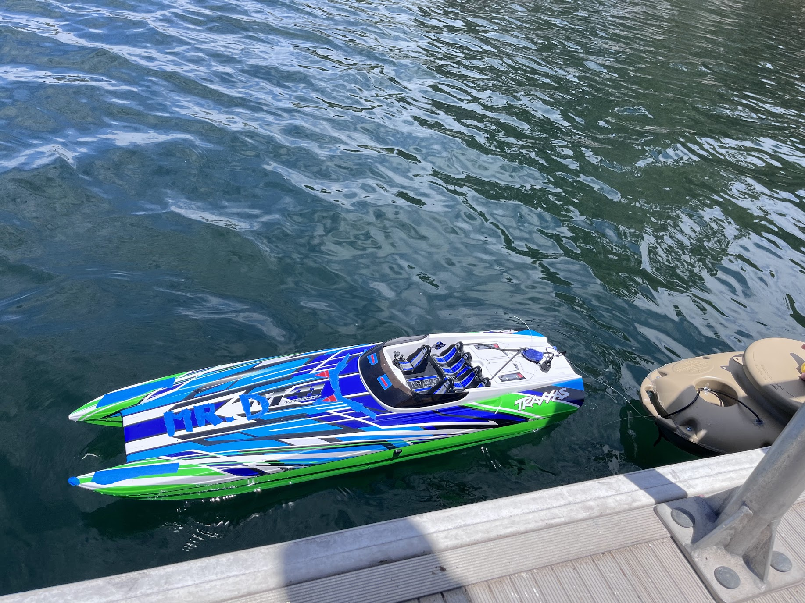
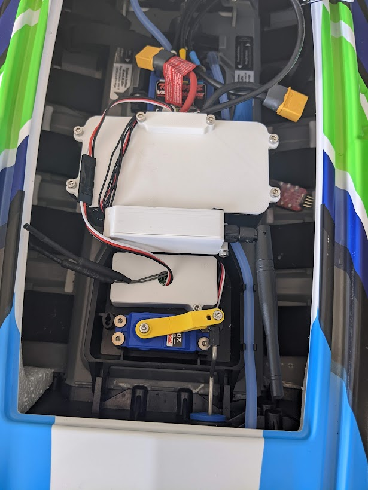
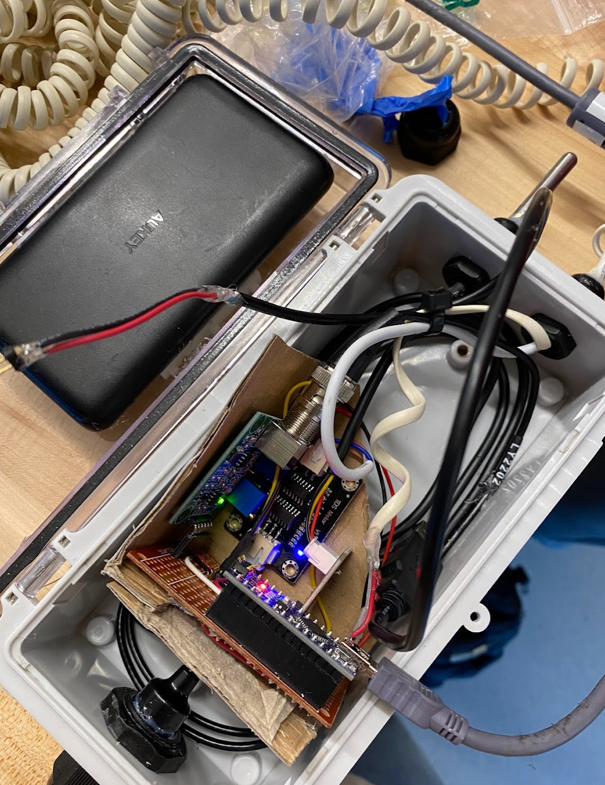
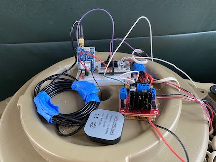

# Autonomous Water Monitoring System

This project focuses on the development of affordable instrumentation and robotic devices to monitor, generate, and analyze water quality data at scale. The system integrates an autonomous surface vehicle, buoy-based instrumentation, and long-range telemetry to enable real-time environmental monitoring across lake environments.  

The project applies principles of autonomous robotics, microcontrollers, and data visualization/analysis, while adopting engineering best practices in system integration, testing, and documentation.

---

## Project Components

### Boat
- Converted a Traxxas high-speed RC Boat into an autonomous surface vehicle.  
- Integrated a flight controller, GPS, and a radio link to communicate with autopilot software on a base station computer.  
- Designed and 3D-printed enclosures to protect electronics from water exposure.  
- Modified the steering system for improved agility and responsiveness.  

### Buoy
- Designed and constructed buoy-based instrumentation for water quality data collection.  
- Built two buoy variants:  
  - One for collecting surface data with instrumentation submerged off the sides.  
  - One with a submersible payload for lowering and raising instruments to collect vertical profiles of water quality data.  

### Data Acquisition
- Calibrated and oversampled sensor data to improve accuracy.  
- Programmed microcontrollers to acquire and relay sensor readings to the telemetry subsystem.  
- Established communication protocols and data formats for reliable integration between acquisition and telemetry.  

### Telemetry
- Implemented data communication between buoys and the base station using long-range radio (LoRa).  
- Developed microcontroller firmware to:
  - Receive sensor data via serial connection.  
  - Combine readings with GPS coordinates and timestamps.  
  - Transmit the combined packet via LoRa to the base station.  
- Configured base station hardware to receive LoRa transmissions and forward them to a Linux-based server.  

### Data Storage and Analysis
- Configured the server to ingest data received via serial from the telemetry subsystem.  
- Designed a normalized SQLite database schema for storing sensor and location data.  
- Developed Python scripts to populate the database in real time.  
- Created a Python-based dashboard and Jupyter notebooks for visualization, modeling, and analysis of collected data.  

---

## Data Flow

